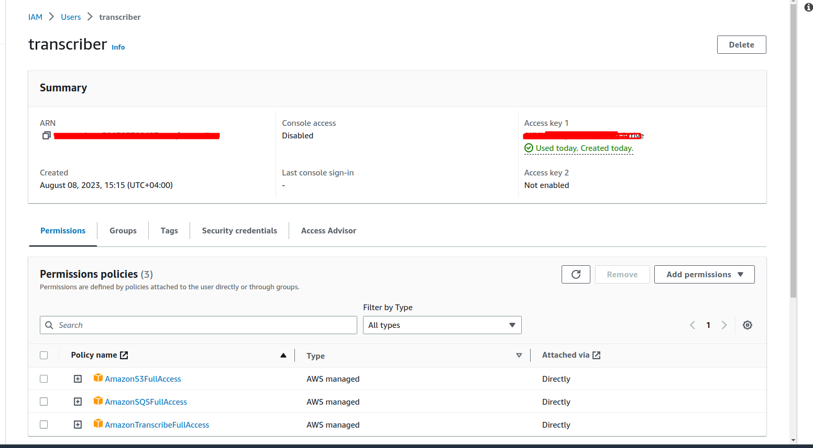
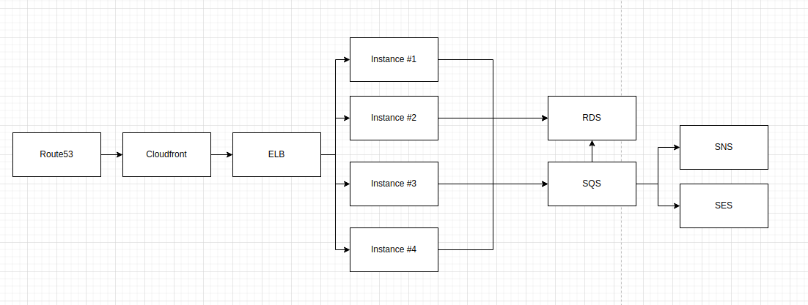

A test-work for Sedric.ai.

Used tools and tech:
1. Laravel
2. Docker
3. Docker-compose
4. Redis
5. MySQL
6. Nginx
7. AWS S3
8. AWS SQS
9. AWS Transcriber

# Installation

1. ```git clone git@github.com:alkhachatryan/sedric-test.git```
2. ```composer install```
3. ```cp .env.example .env```
4. ```sudo make start```

Connect to the app container via ```sudo make connect_app``` to run the following:
1. ```php artisan key:generate```
2. ```php artisan migrate```

For this stage the app is installed on machine.
Activate scheduler and queue worker. For that you need to open 2 CLI interfaces and type:

```sudo make connect_app``` and in it type ```php artisan queue:work```
In the second terminal run:
```sudo make connect_app``` and in it type ```php artisan schedule:work```

For this stage the app is up and can receive a requests.

## How it works
1. User sends a post to the server
2. A server creates a record in DB and dispatches a queueable job.
3. That queueable job uploads a file to S3 and provides a URL to Transcriber so it start to work.
4. Then there is a scheduled job which run once a minute BUT WITHOUT overlaps. That means it'll not be ran second time when the previous one has not been finished. That job gets all the records from DB which status == PROCESSING_BY_AWS. It sends a request to AWS to check the status of transcription and if it's == COMPLETED does the following: searches for the given sentences in the text, sets the indices of them and then updates the status of the record to PROCESSES.


## Queue
Pay attention to the queue driver - you can use Redis for local/dev environments and SQS for production.
Set QUEUE_CONNECTION from sync to redis/sqs. If you want to use SQS, update your AWS credentials. Keep in mind that the user which access keys will be used in .env should have accesses to S3, SQS and Transcriber


## Notes
1. Transcriber service is not available in all zones so I decided to use eu-central-1 (Frankfurt)
2. Because of it I decided to use SQS and S3 from that zone for better performance (especially for S3, because Transcriber uses files from S3)
3. All uploaded files are NOT located in the root of the bucket, but in the folders named like YEAR-MONTH (2023-08) for better performance. There can be problem with a hard disk if the folder will contain a millions of file NOT divided in folders and to make it faster we need to divide files into subfolders (ext4 rule). We know that S3 is in the cloud and uses cloud-tech however I believe dividing by folders is a good solution.
4. I already have an EC2 instance and some services from free tier so I cannot create a new one for this task.
However this is the ideal architecture as for me:

So the request comes to some instance through the Route53, Cloudfront, ELB, then the instance adds a record to DB and adds a job to SQS. After all the jobs are done the queued job can send an email to someone and a notification with SNS.
5. As I didn't provide an EC2 instance as I already have a free tier usage and cannot deploy my API to it, I provide you a Postman collection, so when you up an application you just can send a requests to the local built application.

## Deployment theory
I would do the following for automated deployment and tests:
1. Write feature tests
2. Have dev and master branches in github
3. Create a github workflow file and use it with rules, so nobody can push to the master if the tests are not passed
4. Enable CodeDeploy with installed agent on all instances
5. Enable CodePipeline in my account so for each new commit on master we do automatic deployment
